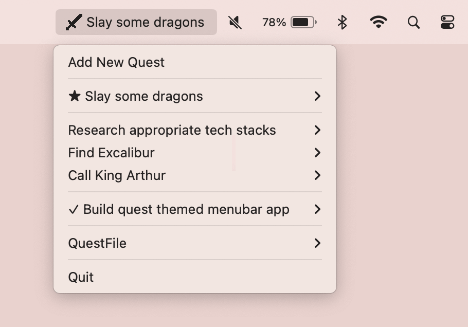
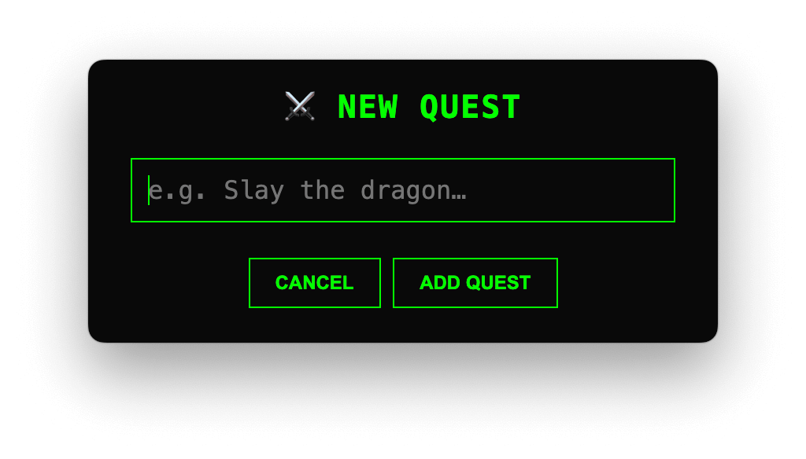

# 🧙‍♂️ QuestBar
A lightweight, native-feeling Electron menubar app to track your **quests**, powered by modern JavaScript, fantasy vibes, and pixel-perfect polish.




---

## ✨ Features

- 📋 **Track your quests** — Add, check off, and organize TODOs like epic missions
- ⭐ **Set active quest** — Show your current focus right in the macOS menu bar
- 🖱️ **Quick access** — Menubar app with context menu controls
- 📁 **JSON-based persistence** — Easy to open and batch-edit in a text editor
- 🧼 **Smart truncation** — Tray title fits neatly, even on Retina displays
- 🧙 **RPG-style naming** — “Vanquish”, “Resurrect”, “Start Quest”… yes, please!

---

## 🚀 Getting Started

### 1. Clone the repository

```bash
git clone https://github.com/yourname/questbar.git
cd questbar
```

### 2. Install dependencies

```bash
npm install
```

### 3. Start the app in dev mode

```bash
npm start
```

---

## 🛠️ Project Structure

```bash
├── main.js               # Main Electron process (ESM)
├── preload.js            # Secure IPC bridge
├── prompt.html           # Custom quest input UI
├── prompt.css            # Styled parchment input
├── iconTemplate@2x.png   # Tray icon (Retina-friendly)
├── parchment.png         # Background texture for prompt
├── questbar-quests.json  # Saved quest data (auto-created)
```

---

## 📦 Packaging the App

To package it for non-App Store distribution:

Update your env vars cert to Developer ID Distribution and run:

```bash
npm run build
```

To package it for the App Store, update env vars certs to Apple Distribution and Mac Installer then run:

```bash
npm run build:mas
```

---

## 🧠 Keyboard Shortcuts

- **Enter** — Submits a new quest
- **Escape** — Cancels the prompt
- **Click outside** — Closes the prompt
- **Right-click menu** — Control quests directly

---

## 💾 Quest File

All your quests live inside:

```
~/Library/Application Support/questbar/questbar-quests.json
```

You can edit this file manually, back it up, or sync it via git/dotfiles.

---

## 💡 Customization Ideas

- Add quest categories or tags
- Sync across machines

---

## 🧝 Acknowledgments

Inspired by RPGs, productivity hacks, and the magic of making TODO lists fun again.
